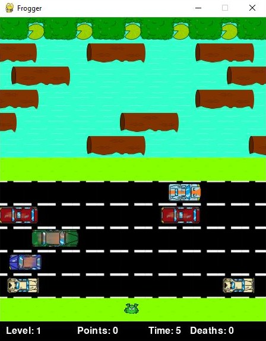
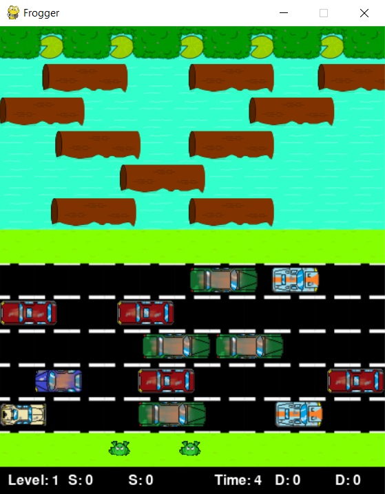
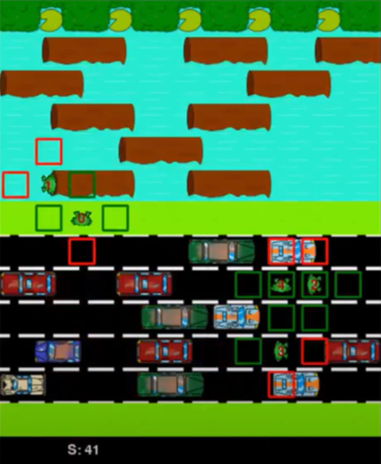
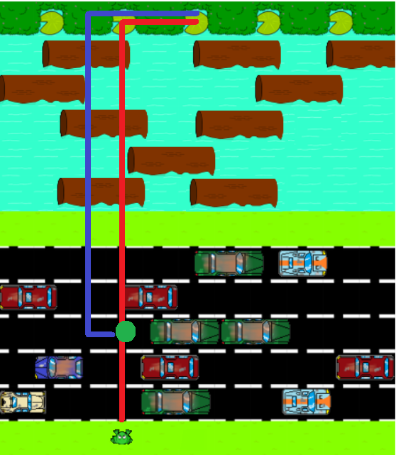
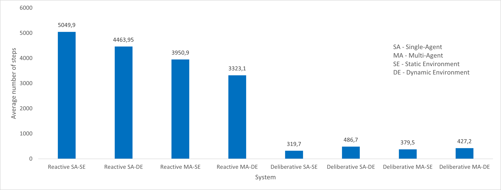

# Introduction

For our project development, we started with a version of a game called
"Frogger" where a player controls one frog at a time in order to reach
the leaves on the top of the map. In our case, instead of having only
one frog trying to reach all five leaves, we would have several agents
cooperating to reach the goal: have a frog on each of the five leaves.
We started with this python version of the game available at:
*<https://github.com/jgubert/frogger>*, and we adapt it to our needs.

## Motivation

We chose this game and adapted it to a multi-agent system to understand
how several different types of agents would react to this environment.
The original goal of the game is for the player to reach all five leaves
on the top of the map, so we came up with the idea where instead of
having just one frog at a time, we would have multiple frogs trying to
reach those five leaves. The motivation for the multi-agent is to have a
communication mechanism which allows for the cooperation of those agents
in order to achieve the desired goal.

## Problem definition and relevance

The adapted game takes place in a 2D environment and the multi-agent
system has between one and five agents (frogs) whose goal is to reach
one of the 5 leaves on the top of the map, as seen in the Figure
[1](#fig:frogger2agent).

## Requirements

The system is composed by a dynamic number of cars in the road and
trunks in the river, depending on the layout of the map that we will be
changing and if the environment is static or not. The number of agents
at the same time will be either 1 or 5. The requirement that we defined
in our system, to properly compare the results was to have the complete
the objective 3 times, meaning when the five leafs would get reached,
another round would start, for a maximum of 3 rounds.

## Objectives

Our objective is to compare how our different approaches of an agent
deal with our environments with slight variations regarding the number
of dynamic cars and trunks on the road and on the river, respectively.
We will compare our agents and approaches by measuring the performance
using different metrics described on Empirical Evaluation.

# Approach

## Environment

The game environment is composed by:

  - a starting area at the bottom of the map, where the agents spawn in
    the beginning of the game or when they die and get re-spawned.

  - the road area with 5 lanes, where some cars drive horizontally from
    one side of the map to another or they will be completely static in
    the middle of the lane. We would like to, if possible, also have
    cars moving in one direction in some of the lanes in some other
    versions of the map.

  - the river area, which contains some tree trunks, where some trunks
    float horizontally from one side of the map to another or they will
    be completely static in the middle of the river. The agents should
    be on top of these trunks to navigate through the river. Again, we
    would also like to have some lanes of these wooden logs moving in a
    direction.

  - the goal area, which is on the top of the map, contains the leafs
    where the agents should reach, each leaf can only have one frog.

We can say that the environment is inaccessible since the agents can
only "see" the four positions adjacent to him. Also, the environment is
deterministic because the actions have a guaranteed effect, i.e. if an
agent tries to move into a position where there is a car, it will
certainly move to that position, but he will die doing so, returning to
the starting area after. Also, in the case where the cars and trunks do
not move, the environment has the property of being static, as seen in
Figure [2](#fig:froggerstatic), because, while the agent is doing its
decision, the world does not change, but in the case where both the cars
and trunks move, the environment is susceptible to change while the
agent deliberates. Since in this environment we have a finite number of
possible actions and percepts, we can also classify it as a discrete
one.

## Agent

The agents choose between 5 actions: right, left, up, down and stay. In
the road area, if an agent tries to move into a position which is
occupied by a car, the agent will die and re-spawn at the starting area,
as said above. In the river area, the agent should stay on top of the
tree trunks in order to stay alive while crossing this area, so, if it
tries to move into a position which is not occupied by a trunk, the
agent will die and re-spawn at the starting area. Also, agents cannot
move outside the map, meaning that whenever they try to do so their
position will remain unchanged. Finally, when two agents collide, they
both die and get placed back to the starting area.

In this system, the agents sensors allow him to understand if there are
obstacles or not in the four directions: front, back, left and right. As
said before, the agents can perform five actions, meaning that these
agents have the mobility property.

## Architecture

Our agents will be autonomous in this multi-agent system.  
Regarding the properties of our agents we can say that they will have
the following abilities:

  - **cooperation** - share information with other agents of where are
    the cars on the road and where are the trunks on the river to help
    each other to archive the same goal of reaching all the leaves on
    the top of the map.

  - **coordination** - manage inter-dependencies between activities. It
    is needed to use a non-shared resources in the map and agents need
    to coordinate to use this resources at a time. Since agents need to
    avoid colliding with each other, they need to coordinate to not
    collide with each other by managing their place on the map with each
    other.

  - **negotiation** - being able to reach an agreement on common
    interest. They will have to negotiate their position on the map
    because they can’t share the same position with each other so they
    need to reach an agreement when two agents want to go to the same
    position on the map.

  - In the beginning, **re-activeness**, they will solely react to
    events without recognizing opportunities, we’ll use this approach as
    a baseline for our following approach.

  - Then we will try another approach which will have our agents being
    **proactive** which means they will not react solely to events but
    taking initiative and recognize opportunities. Our agents will have
    social abilities to interact with other agents through cooperation,
    coordination and negotiation.

  - Furthermore, we would also like to have **hybrid** agents, in order
    to join both **re-activeness** and **pro-activeness**, having a
    subsystem capable of reacting to events without complex reasoning
    but also having a subsystem which develops plans with practical
    reasoning.

# Empirical evaluation

In order to test our system, we chose some metrics that will allow us to
determine the performance of the agents. Firstly, we will have a metric
that tells us the total number of steps taken by the agents. Second, we
will count the total number of deaths in the progress. We will also
count the total number of plans created by the agents, in the
deliberative architecture.

# Implementation

In total we have developed/tested 8 systems:

  - The reactive autonomous agent in a static environment

  - The reactive multi-agent in a static environment

  - The reactive autonomous agent in a dynamic environment

  - The reactive multi-agent in a dynamic environment

  - The deliberative autonomous agent in a static environment

  - The deliberative multi-agent in a static environment

  - The deliberative autonomous agent in a dynamic environment

  - The deliberative multi-agent in a dynamic environment

We have started by working on the reactive autonomous agent in a static
environment, first using only one agent which had to reach each leaf,
controlling one frog at a time, and later having 5 reactive agents
running at the same time to achieve the goal. After completing these two
systems we started creating the deliberative agent in a static
environment. Then we continued by developing the deliberative
multi-agent system also in the static environment. After having all four
static systems working, we proceeded to extend those systems to a
dynamic environment, where the cars would move.

## Game Implementation

We used a Frogger open-source implementations as a foundation but we
added a lot of other functionalities, removed others and corrected some
bugs in the code.  
We started by refactoring the game code so it would be easier to add new
functionalities. The game was originally all implemented in one file, so
we moved classes and functions to new files. We removed the frog
animations in the game so that there wouldn’t be intermediate states in
the frog movement, this change made it easier for the sensors to detect
the environment at each step.  
We implemented from scratch a new static map, we placed the trunks and
the cars in a challenging way so it would be harder for the agents to
get through. We made various versions of the map until we got the final
one with some hard corners were the agents can get stuck that made it
impossible for them to just moving straight in a line to the
objective.  
We also added some visual feature such as hollow squares surrounding the
agents that represent their sensors (top, bottom, right and left sensor)
as we can see in Figure [3](#fig:froggerboxes), if the square is green
it means that if the agent was at that position he would be safe, if the
square is red it means that if the agent was at that position he would
be dead. We also added numbers on top of each agent to make it easier to
distinguish them and keep track of them when they are moving through the
map.  

## Reactive autonomous agent

For this system, the agent moves through the environment almost
randomly, the agent starts by getting information from his sensors in
order to know if he can move to the position on its left, right, above
or below. After getting this information, some of those four positions
will be available for the agent to move into and others not. So, in the
decision making, the agent creates an array with four positions
\[u,d,l,r\] that correspond to the four actions: up, down, left and
right, respectively. This array has, for each index, the value 0 or 1,
where 0 means that the if the agent selects that action it leads to its
death, and 1 meaning that that action can be executed to move to the
desired position. Having this array of 0’s and 1’s, the agent then
multiplies that array by the array of what we have called the
"priority", which is an array of probabilities, for each action to be
executed. So, for example, if the array of possible actions is
\[0,1,0,1\], meaning that the agent in the current position can execute
the action "down" and "right" without dying, then it will multiply that
array with the priorities array, for example \[0.55, 0.05, 0.2, 0.2\]
which means that we want to give more probability for the agent to move
up (if he can execute the action to move up), so after multiplying both
arrays we get a new array = \[0, 0.05, 0, 0.2\], which we want to
normalize, getting the following array \[0,0.2,0,0.8\], which means that
in the current position we want to execute the action "down" with 20%
probability and the action "right" with 80% probability. Then, using a
random number generator we can easily chose the action to perform.

This agent, in a static environment never dies, because the cars do not
move and the agent only selects actions that do not lead to its death.
But in the dynamic environment, where the cars move from one side to
another, the agent might die sometimes, because it might see a position
without an obstacle, but as soon as it moves to that position, a car
runs him over. Having an analogy with the humans, if we are trying to
cross a road without a crosswalk, and we see a car moving towards us we
do not step on to the road, but this reactive agent would move, since he
cannot see the car moving because he can only see if the car is (or not)
in the position that he wants to move into.

Another improvement that we have added was in the "priority" array,
described above, where we defined two different values for this array,
for the case where the agent was still on the road area, and for the
case where the agent was in the river area. Basically, we wanted to have
less probability for the agent do move down when he was in the road area
and more probability for the agent to move down when he was already in
the river area to allow him to go to another leafs when the others had
been already reached. After searching for the best priority array for
each of the parts of the map we found out that the array that gave the
best results was: for the road area \[0.55, 0.05, 0.2, 0.2\], and for
the river area \[0.4,0.3,0.15,0.15\].

## Reactive multi agent

For the reactive multi-agent system, each of the agents followed the
same approach as in the reactive autonomous agent, but in this case
agents have to take into consideration that a position can be occupied
by another agent, so when trying to move, the perceptions that the agent
gets do not depend only on the cars and tree trunks, but also from the
other frogs. In the multi-agent case, agents might get surrounded by
others, making it impossible for an agent to move to any of the adjacent
positions, so at that step the agent will not be able to execute any
action. Thus, it will simply remain in the same position, in other
words, do the action "stay".

## Deliberative autonomous agent

In the deliberative decision making, in the architecture that we have
defined, the agent has a python dictionary, that represents the agent’s
beliefs, which we have called "known\_map", in which the key is a
position, for example (43,375), and the value for that key is a list of
actions that the agent thinks that cannot be executed in that position.
For example, if the "known\_map" contains the key-value pair:
(43,375):\["up", "left"\], it means that the agent knows that in the
position (43,375) he cannot execute either the action "up" or "left".
The "known\_map" contains only entries for the positions that the agent
has already visited, (so initially it is empty), and this dictionary
does not save positions where the agent has the possibility of executing
every action. This dictionary is crucial for the creation of plans.

The autonomous agent starts with a set of desires, which are positions
of the leafs to be reached.

At each step, the agent performs the following:

  - First, the agent updates its beliefs (explained below).

  - Then, if it has no intention, is selects a desire, randomly, from
    the available ones.

  - After that, if the agent does not have a plan, then it tries to
    create one.

  - Having the plan, if the plan is sound, meaning that the next action
    to perform will not lead to its death, he tries to execute the first
    action on the plan. On the other hand if the plan is not sound, then
    the agent will try to create a new plan.

The function that updates the beliefs, simply checks which actions can
be executed in the current position and updates the "known\_map". So if
an action cannot be executed in a certain position because it would lead
to the agent’s death, then that action would be added to the list of
prohibited actions for that position in the "known\_map".

To build the plan, we have used a breadth-first search in order to get
the shortest path from one point to another. In this function, that
delivers the shortest path, we have done a slight modification in order
to use the knowledge obtained already by the agent represented in the
"known\_map", where we would only search a path from a adjacent
position, if it was possible to reach that position. This makes the
agent have a behaviour where, initially, since it has low information
about the map, it creates a plan in which it tries to move all the way
up and then to the left or right, according to its intention, as obvious
this plan will fail, because as seen in Figure [2](#fig:froggerstatic),
the agent cannot simply execute the action "up", he has do deviate from
some cars and to move over some trunks.

The agent will learn about the positions of the cars and trunks as he
interacts with the environment, and therefore creating better plans in
later stages.

The Figure [4](#fig:deliberativeagentplans) shows an example of the
beginning of a deliberative agent. When the agent starts his run, he has
nothing in his "known\_map", so it will think that to reach its
intention (third leaf) it should be able to go all the way up, (red line
in the image). So the agent will start executing his plan, it will
execute the action "up" three times, to reach the green dot in the
image. But when the agent reaches that point, it will notice that he
cannot move up, because there is a car in the position above, so the
agent will have to re-plan in order to achieve its intention. Remember,
that this is the first run of the agent, for that reason, so far the
agent has only been in 4 positions, meaning that the "known\_map" has
four positions. Then, from the green point, the agent creates a new
plan, represented in blue. This plan will be executed until the agent
reaches the first tree trunk in the river area, where it will have to,
once again, re-plan in order to achieve its intention. And so, the agent
will continue creating these plans as he moves along the environment,
until finally reaching its intention. After reaching that leaf, the
agent has still four other leafs to reach, but now, when creating plans,
the agent will have a lot more information to consider in its
"known\_map", its beliefs\!

## Deliberative multi-agent System

In the deliberative multi-agent system, we used a communication
mechanism in order for the agents to :

  - Share its intentions with the other agents, so that two agents do
    not try to move to the same leaf.

  - Share the prohibited actions for a certain position of the map with
    the other agents, in order for the other agents to update their
    "known\_map".

When an agent communicates its intention to the other agents, each of
the agents that receive the message removes that position from its
desires, and then proceeds to select their intention.

Now the update beliefs function does not take into consideration other
frogs, this is because we do not want the agents to think that a
position cannot be reached later just because there was a frog earlier.
For example if an agent sees that there is another agent in the position
above, it will not add to the prohibited actions of the current position
the action "up". So when planning, the agents do not take into
consideration the position of the other agents. Other than that
adjustment, in the update beliefs function we did also add the part to
communicate the prohibited action in the current position for an agent.

Another problem encountered in this system was that agents could get
stuck in some trunks because they would want to go down in order to
achieve their goal, and there would be another agent trying to go up. To
solve this, we asserted that if the plan of an agent was not sound, and
after re-planning the plan remained the same, we would make the agent
have a reactive decision for a fixed number of steps (which we found out
that 3 steps of reactive decision would properly result).

## Deliberative agent in a dynamic environment

In the dynamic environment for the deliberative agent system, we have
used the same architecture as the one used in the static environment.
But now in this case some new problems could occur. As said before,
while interacting with the environment, agents save for each position
visited so far the prohibited actions for that position. But since we
have cars moving now, agents might think a car is in a certain position
but actually it is not, because the agent saw the car earlier in that
position. This might make the plan building step fail, because an agent
would think that there was a whole line of cars blocking the road,
(which actually never happens). So, we have defined that if an agent
cannot create a plan to reach its intention, the agent becomes reactive
for some steps (3 steps of reactive decision). This behaviour will make
the agent move randomly, as explained in the reactive decision section,
which will be useful for the agent to get new perceptions and thus
update its "known\_map". And after this update, the agent might now be
able to create a plan.

# Comparative analysis

We have defined that in each of the systems we would want the
agent/agents to achieve the goal 3 times, in other words, have a frog in
each of the five leafs at the same time multiplied by three times. So,
basically each leaf would get occupied 3 times during the whole run,
being 15 the total number of leafs reached at the end of the run.

After 20 runs for each of the agent architectures for both the single
and multi-agent system in the two environments, the first thing we can
conclude is that the deliberative agent is much better than the reactive
one. Regardless of the type of system and environment our agent is in,
the number of steps required to fulfil its goal with a deliberative
architecture is much lower (a few hundred steps) than with a reactive
architecture (thousands of steps). This was expected, since a
deliberative agent plans the route he wants to take to its objective,
while the reactive agent goes in the environment trying to go up every
time it’s possible, even if going up does not take it to a possible
leaf.

In the Table [\[table:comparison\]](#table:comparison) we can see that
for the static environments we have the "N/A" value for deaths, this is
because the agents do not die in a static environment, because they
never execute a action that leads to their death. In the other hand, in
the dynamic environment we can see that agents do die, this happens
because an agent can see a position without a car in a certain instant,
but as soon as the agent moves to that position, a car also moves to
that position, killing the agent.

Also, the average number of plans created in the reactive architecture
is not filled since, as obvious, these agents do not create plans.

Regarding the number of steps, we can clearly note that the average
number of steps is much higher in the reactive architecture than in the
deliberative one. Since the reactive agent has a randomness associated
with each action, the standard deviation of the results obtained is
relatively high. For instance, in the runs that we have done for the
reactive autonomous agent in a static environment we could see that in
the agent was able to sometimes achieve the goal in under 3500 steps and
in some other runs it would take over 7000.

Meanwhile, in the deliberative architecture we can see that the average
number of steps is much lower, but more importantly, that the value for
the standard deviation for the number of steps in those 20 runs is also
much lower, compared to the results on the reactive architecture. This
results is as expected since, after learning more about the environment,
the deliberative agent will mostly follow the same routes to reach each
of the leafs on later stages which will make standard deviation between
different runs lower.

Moving on to the number of deaths, we can see that the agent never dies
in the static environment, regardless of the architecture and system.
That was to be expected since in both the architectures the agent
verifies if there is an obstacle, i.e., a car or no trunk, in a certain
position it wants to go, so, if the agent dies in the static
environment, that means its algorithm is not implemented how it should
be. In the dynamic environment the agent dies sometimes because it
cannot predict the position of the obstacles, as they are always moving.
In the study we made the values for the average of deaths are slightly
different, as the reactive single-agent dies more than twice as much
(32.95 deaths) as the others (13.75, 14.45, 13.8 deaths respectively).
We believe this happens because the reactive agent stays in the road for
more time than the deliberative agent, hence, the chance of dying is
higher. However, the fact that the same architecture but in a
multi-agent system has less deaths, makes this metric not accurate for
comparison with the deliberative architecture. We could also say that
the lower number of deaths in the multi-agent systems compared to the
single-agent systems is due to the fact that with more agents in the
map, each agent has less room for making a move, but overall we believe
that the deaths number has a random factor in it and should not be
considered for comparisons.

We can also note, as expected, that the average number of plans created
by agents is much more higher in the dynamic environment than in the
static one. This happens because when cars move, a plan created by the
agent will mostly not be completely executed. But in the static
environment, after learning a path to a specific leaf, the agent can, in
the next round, basically make the same plan to achieve it. While in the
dynamic environment it won’t be able to, because to reach the same leaf,
the agent might have to create different plans due to the moving cars.

Another interesting result is that the standard deviation for the number
of plans for the autonomous agent in a static environment has a low
value, meaning that the agent is creating almost every time somewhere
around 23 plans. Also, the standard deviation for the number of plans
created by the agents in the multi-agent system in the dynamic
environment is much higher, this is, again, due to the unexpected
encounter with cars along the run of an agent.

| **Architecture** | **System** | **Environment** | **Avg Steps** | **SD Steps** | **Avg Deaths** | **SD Deaths** | **Avg Plans** | **SD Plans** |
| :--------------: | :--------: | :-------------: | :-----------: | :----------: | :------------: | :-----------: | :-----------: | :----------: |
|                  |            |   **Static**    |    5049.9     |   1373.64    |      N/A       |      N/A      |      N/A      |     N/A      |
|                  |            |   **Dynamic**   |    4463.95    |   1009.37    |     32.95      |     9.20      |      N/A      |     N/A      |
|                  |            |   **Static**    |    3950.9     |   1404.96    |      N/A       |      N/A      |      N/A      |     N/A      |
|                  |            |   **Dynamic**   |    3323.1     |    904.91    |     13.75      |     5.32      |      N/A      |     N/A      |
|                  |            |   **Static**    |     319.7     |     5.44     |      N/A       |      N/A      |     23.0      |     1.21     |
|                  |            |   **Dynamic**   |     486.7     |    58.13     |     14.45      |     5.84      |     94.15     |    17.71     |
|                  |            |   **Static**    |     379.5     |    27.21     |      N/A       |      N/A      |     69.75     |    12.37     |
|                  |            |   **Dynamic**   |     427.2     |    55.03     |      13.8      |     5.82      |     97.55     |    22.18     |

# Final Remarks

After concluding the project, we could see some improvements that could
be added later, such as, in dynamic environments, make the agents
calculate the speed of the car they see ahead and communicate the
position, direction and the speed of the car to other agents so that the
others could create more reliable plans. However, these additions have
costs, for example in performance, since in a more complex system the
planning would require heavier computations.

Another system that could be implemented for this problem is the
reinforcement learning agent where the agent would learn by reward and
punishments by exploring the environment.
